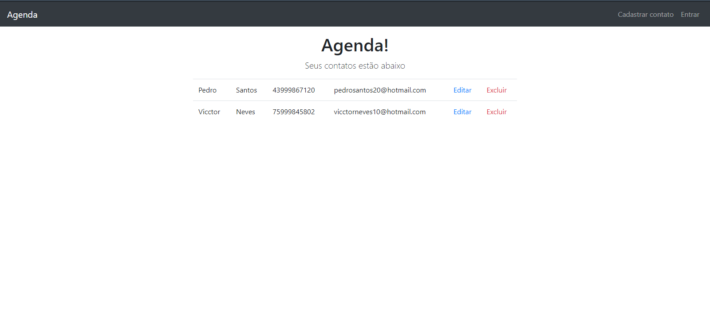
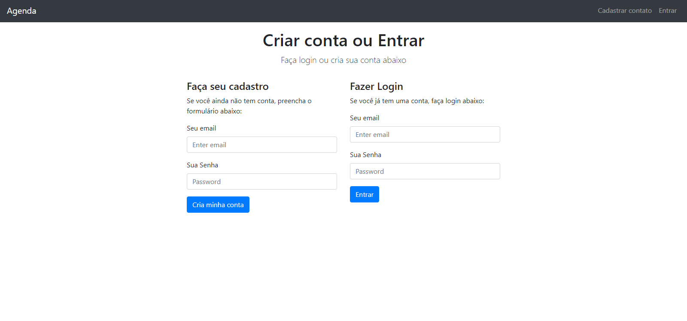
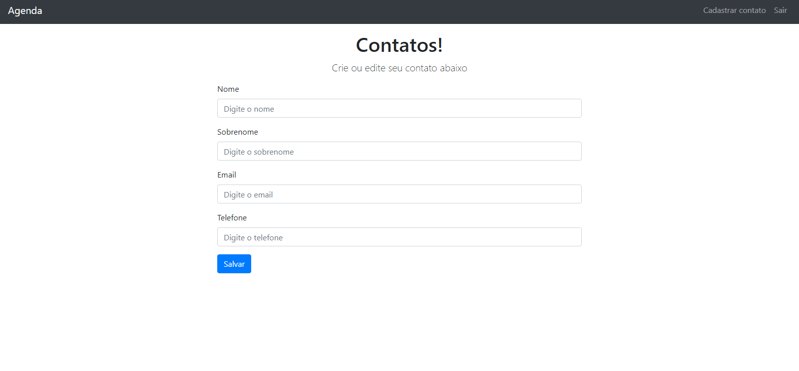

# projetoAgenda
Projeto agenda desenvolvido no curso de Javascript e typescript na seção 11 de node

## Tecnologias utilizada:

- Html
- Css
- Javascript
- Node
- Express
- MongoDB

## Previews

Tela da agendas de contatos onde somente é possivel deletar, editar ou adicionar algum contato apenas logado

 

Tela de login e registro

 

Tela do formulario de adicionar contatos

 
